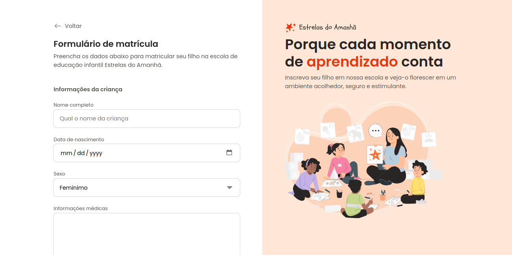

<h1>Formulário de Matrícula ⭐</h1>

Um formulário para matricular crianças na escola de educação infantil Estela do Amanhã

<h2>Descrição</h2>

O projeto formulário de matrícula faz parte do curso Fullstack da Rocketseat e teve como objetivo principal praticar os estilos nas tags HTML de formulário, como inputs, selects e buttons. Nele, foi trabalhado todo o front-end da aplicação em cada detalhe.

O layout do projeto foi feito pela rocketseat no Figma. O site para visualização e interação do projeto está disponível <a href="https://annabeatrizpereira.github.io/formulario-matricula/">aqui.</a>

<h2>Tecnologias</h2>

   

<small>Thank you for reading! ❤️</small>

